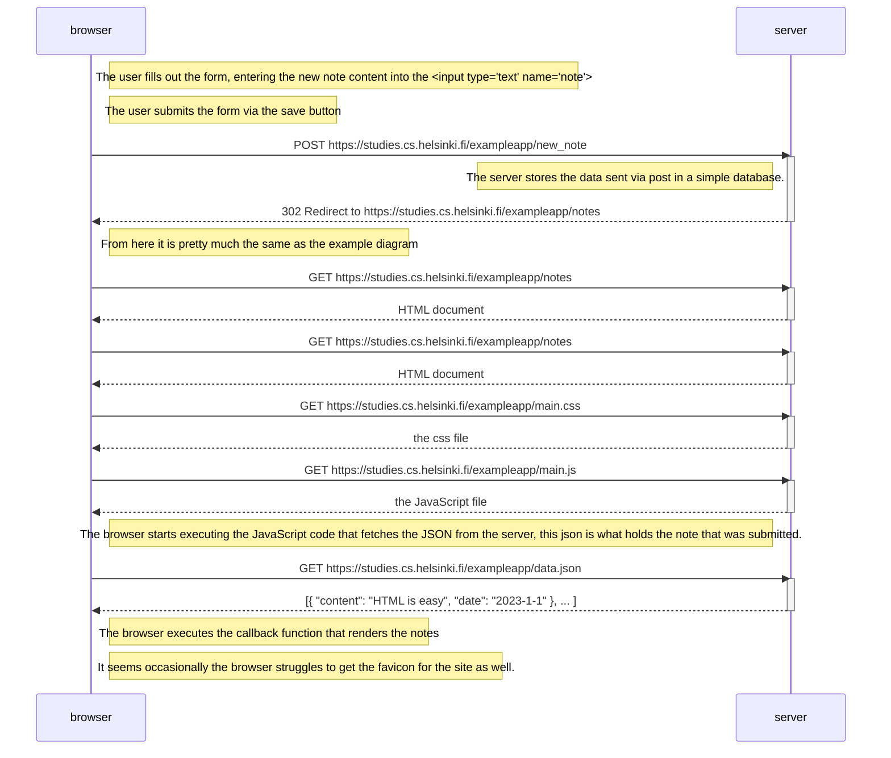

```mermaid
sequenceDiagram
    participant browser
    participant server

    Note right of browser: The user fills out the form, entering the new note content into the <input type="text" name="note">
    Note right of browser: The user submits the form via the save button

    browser->>server: POST https://studies.cs.helsinki.fi/exampleapp/new_note
    activate server
    Note left of server: The server stores the data sent via post in a simple database.
    server-->>browser: 302 Redirect to https://studies.cs.helsinki.fi/exampleapp/notes
    deactivate server

    Note right of browser: From here it is pretty much the same as the example diagram

    browser->>server: GET https://studies.cs.helsinki.fi/exampleapp/notes
    activate server
    server-->>browser: HTML document
    deactivate server

    browser->>server: GET https://studies.cs.helsinki.fi/exampleapp/notes
    activate server
    server-->>browser: HTML document
    deactivate server

    browser->>server: GET https://studies.cs.helsinki.fi/exampleapp/main.css
    activate server
    server-->>browser: the css file
    deactivate server

    browser->>server: GET https://studies.cs.helsinki.fi/exampleapp/main.js
    activate server
    server-->>browser: the JavaScript file
    deactivate server

    Note right of browser: The browser starts executing the JavaScript code that fetches the JSON from the server, this json is what holds the note that was submitted.

    browser->>server: GET https://studies.cs.helsinki.fi/exampleapp/data.json
    activate server
    server-->>browser: [{ "content": "HTML is easy", "date": "2023-1-1" }, ... ]
    deactivate server

    Note right of browser: The browser executes the callback function that renders the notes
    Note right of browser: It seems occasionally the browser struggles to get the favicon for the site as well.

```
